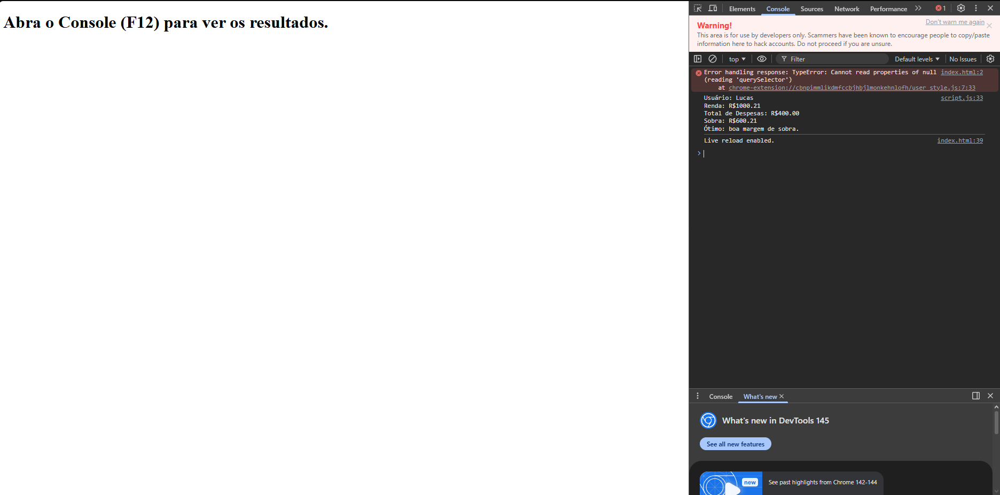

# Trabalho Prático - Semana 7

Nessa atividade, vamos dar os primeiros passos com JavaScript, praticando com a criação de variáveis, emprego de tipos básicos (string, number, boolean), operadores, além de fluxos de controle condicionais e estruturas de repetição (for e while).

## Informações Gerais

- Nome: Lucas Gomes Esteves Da Silva
- Matricula: 927624

## Print do console do navegador

<<  COLOQUE A IMAGEM AQUI >>

